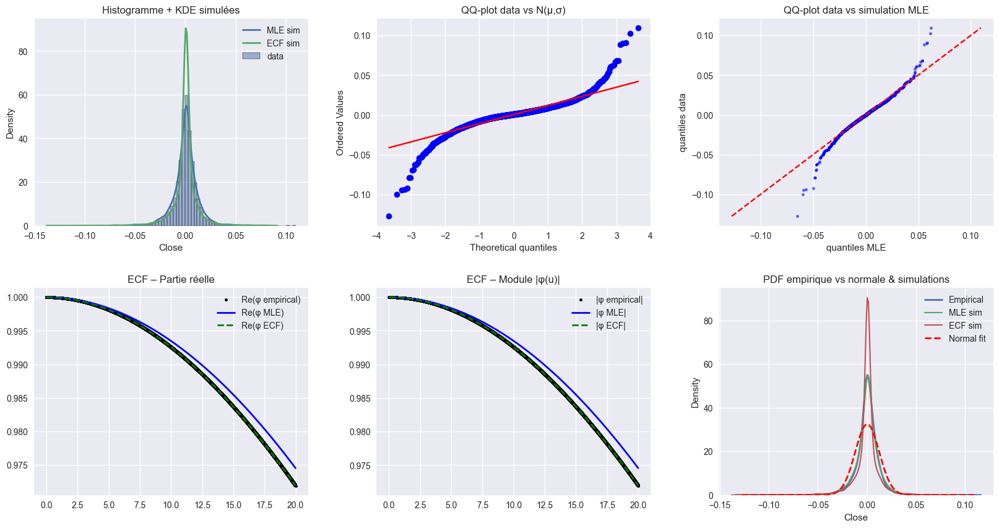
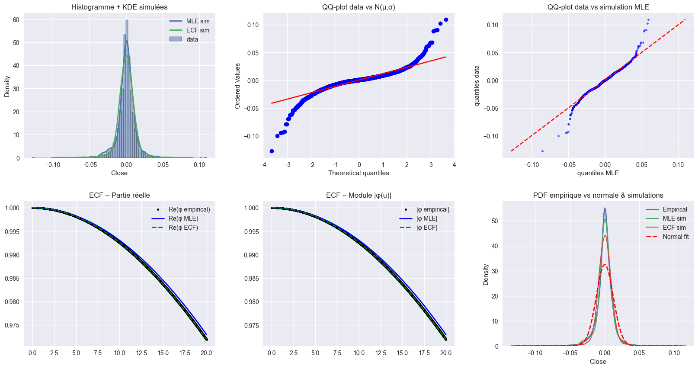
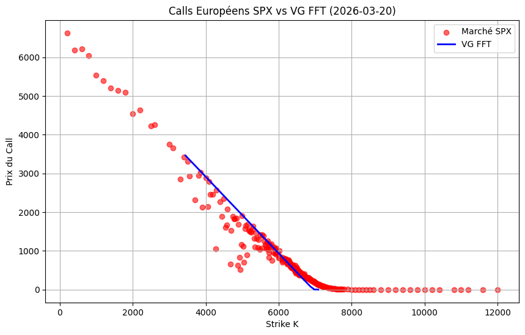
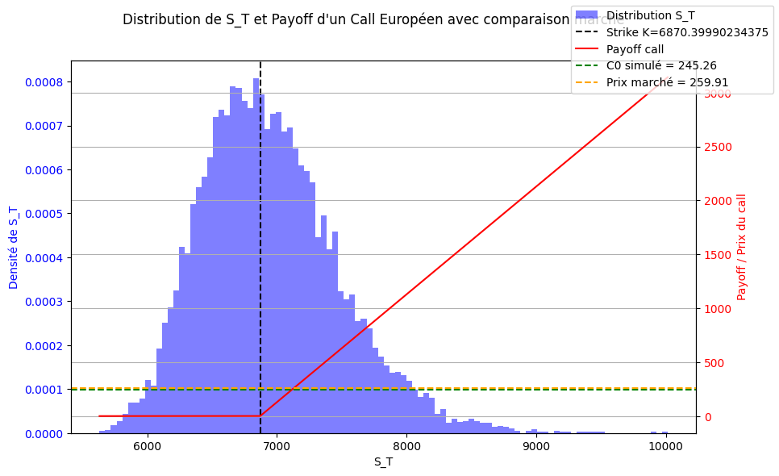

# Calibration and European Call Pricing

## Frequency Grid for ECF and Carr–Madan

- Define frequency grid $u = \{u_0, u_1, \dots, u_{N-1}\}$ for FFT-based methods.  
- Tail behavior captured via **Hill estimator**:

$$
\xi = \frac{1}{k} \sum_{i=1}^k \ln \frac{X_{(i)}}{X_{(k+1)}}
$$

- Maximum frequency bound:

$$
u_{\max} = \text{clip}\left(\frac{10}{\xi}, 1, 20\right)
$$

- Grid:

$$
u_k = k \Delta u, \quad u_k \le u_{\max}, \quad \Delta u \Delta x = \frac{2 \pi}{N}
$$

---

## Parameter Estimation and Calibration

### VG and Merton Models

**Variance–Gamma (VG) parameters:**

| Parameter | MLE      | ECF      |
|-----------|----------|----------|
| $c$       | 0.000916 | 0.000807 |
| $\sigma$  | 0.011431 | 0.012259 |
| $\theta$  | -0.000570| -0.000471|
| $\nu$     | 1.296766 | 4.189263 |

**Merton parameters:**

| Parameter | MLE      | ECF      |
|-----------|----------|----------|
| $c$       | 0.001215 | 0.000587 |
| $\sigma$  | 0.005919 | 0.008389 |
| $\lambda$ | 0.368159 | 0.067692 |
| $\mu_J$   | -0.002387| -0.003699|
| $\sigma_J$| 0.016712 | 0.034358 |

**Statistical comparison :**

|Variance Gamma | MLE |ECF|
|-----------|----------|----------|
| KS        | 0.0296   | 0.1296   |
| Wasserstein| 0.000644 | 0.001903 |

|Merton model | MLE |ECF|
|-----------|----------|----------|
| KS        | 0.030026 | 0.061444  |
| Wasserstein| 0.000581 | 0.000936 |

- **Observation:** MLE better captures empirical distribution and moderate tails; ECF can overestimate volatility/jump dispersion.

docs\markdown\levy-processes.md

**Graph line for VG vs MLE/ECF:** 

**Graph line for Merton vs MLE/ECF:**  

---

### European Call Pricing via FFT (Carr–Madan)

- **6-month call:** $S_0 = 6870.399$, $T \approx 0.296$ yr, $r = 3.83\%$, $q=0$  
- VG parameters (MLE): $\theta = -0.000570$, $\sigma = 0.011431$, $\nu = 1.296766$  
- Drift correction:  

$$
w = \frac{-1}{\nu} \ln(1 - \theta \nu + \frac{1}{2} \sigma^2 \nu)
$$

- Damping factor: $\alpha = 1.2$, FFT parameters: $N=2^{14}$, $\eta=0.025$  
- Strike grid: $0.5 S_0$ to $1.5 S_0$

---

## Results and Interpretation

- **Option prices** computed via Carr–Madan FFT with MLE-calibrated VG parameters.  
- Strike interval: $0.5 S_0$ to $1.5 S_0$. 
- 
 

**Observations:**

- Option prices decrease with increasing strike $K$ (expected behavior).  
- Prices consistent across the strike interval.  
- Confirms VG (MLE) suitability for pricing European calls, capturing tail behavior and asymmetry.

**European Call Intuition:**

- Call grants the right to buy at strike $K$ at maturity $T$.  
- Probability of finishing in-the-money determined by VG-simulated $S_T$ distribution.  
- Model price $C_0$ compared to market price:  
  - **Undervalued:** $C_0$ < market price  
  - **Overvalued:** $C_0$ > market price  
  - **Fairly valued:** $C_0$ ≈ market price  

**Graphical interpretation:**
 

- Histogram of simulated $S_T$ vs payoff:  
  - Most mass lies **right of strike** → high probability in-the-money.  
  - Simulated price $C_0$ < market price → option potentially undervalued.  
  - Probability mass above $K$ → higher expected payoff contribution.  

**Conclusion:**  

- Purchasing the 6-month European call appears attractive: high in-the-money probability + simulated price below market → favorable gain potential.
